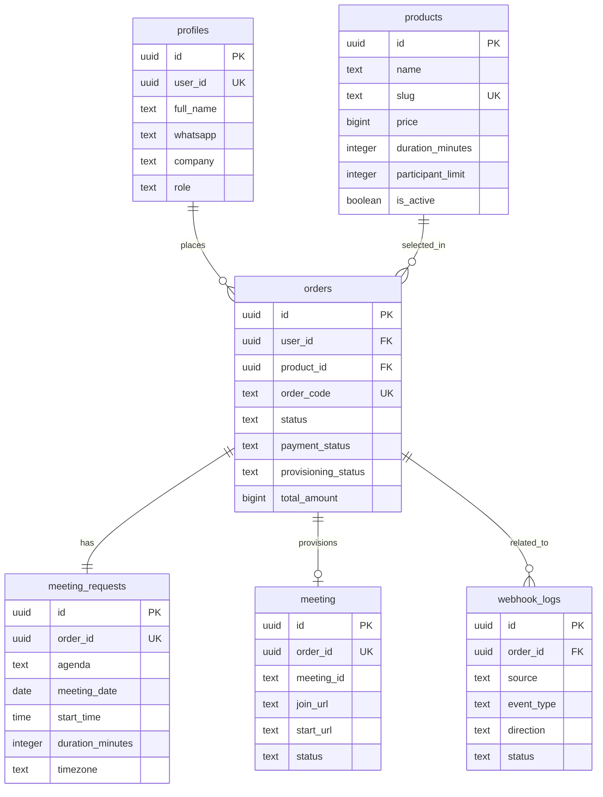

# ERD and Data Design

## Overview

Dokumen ini menurunkan `docs/prd-mvp.md` menjadi model data awal untuk MVP Harian Store. Desain ini ditujukan untuk `Supabase Postgres` dan mengikuti prinsip berikut:

1. `auth.users` dari Supabase menjadi sumber utama identitas pengguna.
2. Data aplikasi disimpan di schema `public`.
3. Satu order merepresentasikan satu permintaan meeting.
4. Satu user dapat memiliki banyak order.
5. Payment utama disinkronkan dari `Paydia` sebelum provisioning Zoom diproses.
6. `n8n` berfungsi sebagai automation layer, sedangkan source of truth tetap berada di database aplikasi.

## Entity Relationship Summary

### `profiles`

Menyimpan profil tambahan untuk pengguna dari `auth.users`.

- Satu `auth.users` memiliki satu `profiles`
- Digunakan untuk data pelanggan dan admin

### `products`

Menyimpan daftar paket meeting yang dapat dipesan.

- Satu `products` dapat dipakai pada banyak `orders`

### `orders`

Entitas utama transaksi pelanggan.

- Satu `orders` dimiliki satu `profiles`
- Satu `orders` mengacu ke satu `products`
- Satu `orders` memiliki satu `meeting_requests`
- Satu `orders` menyimpan data transaksi `Paydia` langsung di kolom order
- Satu `orders` dapat memiliki nol atau satu `meeting` aktif pada MVP

### `meeting_requests`

Menyimpan detail agenda meeting dari order.

- Satu `meeting_requests` dimiliki satu `orders`

### `meeting`

Menyimpan hasil provisioning meeting Zoom.

- Satu `meeting` dimiliki satu `orders`
- Pada MVP, satu order hanya punya satu meeting aktif

### `webhook_logs`

Menyimpan audit trail panggilan webhook keluar dan callback masuk.

- Dapat dihubungkan ke `orders` bila relevan

## Mermaid ER Diagram

## Relationship Rules

1. `profiles.user_id` harus unik dan mereferensikan `auth.users.id`.
2. `orders.user_id` harus mereferensikan `profiles.user_id`, bukan `profiles.id`, agar konsisten dengan identitas auth.
3. `meeting_requests.order_id` harus unik untuk menjamin satu order hanya memiliki satu detail meeting.
4. `meeting.order_id` dibuat unik pada MVP untuk menjamin satu order satu hasil meeting aktif.

## State Design

### Order Status

- `pending_payment`
- `paid`
- `processing`
- `completed`
- `cancelled`
- `rejected`

### Payment Status

- `unpaid`
- `pending`
- `approved`
- `rejected`

### Provisioning Status

- `not_started`
- `queued`
- `processing`
- `success`
- `failed`

### Zoom Meeting Status

- `waiting`
- `started`
- `ended`
- `cancelled`

### Webhook Status

- `pending`
- `success`
- `failed`

## Row Level Security Strategy

### Customer Access

1. User hanya dapat membaca dan mengubah profilnya sendiri.
2. User hanya dapat melihat order miliknya sendiri.
3. User hanya dapat membuat order untuk dirinya sendiri.
4. User hanya dapat melihat detail meeting dan payment milik ordernya sendiri.

### Admin Access

1. Admin dapat membaca seluruh data operasional.
2. Admin dapat memonitor pembayaran, mengelola produk, dan memonitor provisioning.
3. Pemeriksaan admin didasarkan pada `profiles.role = 'admin'`.

## Notes for Application Layer

1. `order_code` perlu dibuat human-readable untuk kebutuhan operasional.
2. `webhook_logs` sebaiknya menyimpan `payload` dalam `jsonb` dan ringkasan error untuk debugging.
3. Semua mutation penting harus idempotent, terutama sinkronisasi payment dan callback provisioning.
