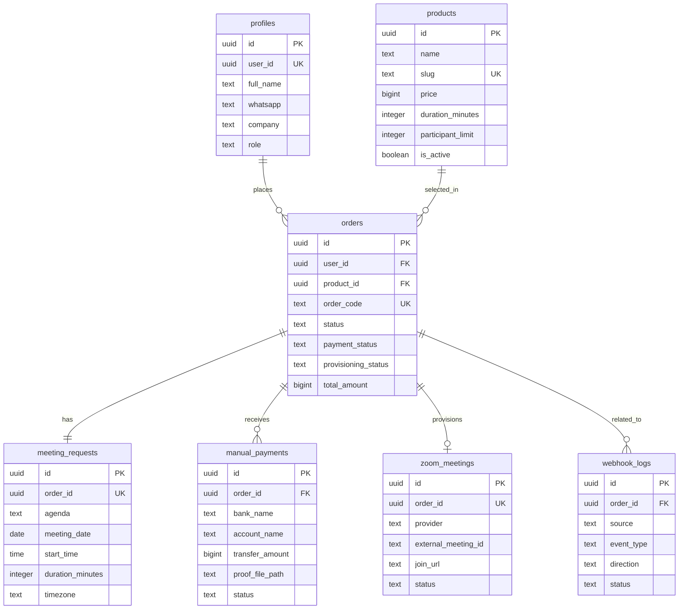

# ERD and Data Design

## Overview

Dokumen ini menurunkan `docs/prd-mvp.md` menjadi model data awal untuk MVP Harian Store. Desain ini ditujukan untuk `Supabase Postgres` dan mengikuti prinsip berikut:

1. `auth.users` dari Supabase menjadi sumber utama identitas pengguna.
2. Data aplikasi disimpan di schema `public`.
3. Satu order merepresentasikan satu permintaan meeting.
4. Satu user dapat memiliki banyak order.
5. Payment manual diverifikasi admin sebelum provisioning Zoom diproses.
6. `n8n` berfungsi sebagai automation layer, sedangkan source of truth tetap berada di database aplikasi.

## Entity Relationship Summary

### `profiles`

Menyimpan profil tambahan untuk pengguna dari `auth.users`.

- Satu `auth.users` memiliki satu `profiles`
- Digunakan untuk data pelanggan dan admin

### `products`

Menyimpan daftar paket meeting yang dapat dipesan.

- Satu `products` dapat dipakai pada banyak `orders`

### `orders`

Entitas utama transaksi pelanggan.

- Satu `orders` dimiliki satu `profiles`
- Satu `orders` mengacu ke satu `products`
- Satu `orders` memiliki satu `meeting_requests`
- Satu `orders` dapat memiliki banyak `manual_payments`
- Satu `orders` dapat memiliki nol atau satu `zoom_meetings` aktif pada MVP

### `meeting_requests`

Menyimpan detail agenda meeting dari order.

- Satu `meeting_requests` dimiliki satu `orders`

### `manual_payments`

Menyimpan bukti pembayaran manual yang dikirim pelanggan.

- Satu `manual_payments` dimiliki satu `orders`
- Banyak entri diperbolehkan untuk mendukung re-upload jika pembayaran ditolak

### `zoom_meetings`

Menyimpan hasil provisioning meeting Zoom.

- Satu `zoom_meetings` dimiliki satu `orders`
- Pada MVP, satu order hanya punya satu meeting aktif

### `webhook_logs`

Menyimpan audit trail panggilan webhook keluar dan callback masuk.

- Dapat dihubungkan ke `orders` bila relevan

## Mermaid ER Diagram

## Relationship Rules

1. `profiles.user_id` harus unik dan mereferensikan `auth.users.id`.
2. `orders.user_id` harus mereferensikan `profiles.user_id`, bukan `profiles.id`, agar konsisten dengan identitas auth.
3. `meeting_requests.order_id` harus unik untuk menjamin satu order hanya memiliki satu detail meeting.
4. `zoom_meetings.order_id` dibuat unik pada MVP untuk menjamin satu order satu hasil meeting aktif.
5. `manual_payments` tidak dibuat unik per order agar pelanggan bisa submit ulang setelah ditolak.

## State Design

### Order Status

- `pending_payment`
- `payment_review`
- `paid`
- `processing`
- `completed`
- `cancelled`
- `rejected`

### Payment Status

- `unpaid`
- `submitted`
- `approved`
- `rejected`

### Provisioning Status

- `not_started`
- `queued`
- `processing`
- `success`
- `failed`

### Manual Payment Status

- `submitted`
- `approved`
- `rejected`

### Zoom Meeting Status

- `pending`
- `generated`
- `delivered`
- `expired`
- `failed`

### Webhook Status

- `pending`
- `success`
- `failed`

## Row Level Security Strategy

### Customer Access

1. User hanya dapat membaca dan mengubah profilnya sendiri.
2. User hanya dapat melihat order miliknya sendiri.
3. User hanya dapat membuat order untuk dirinya sendiri.
4. User hanya dapat melihat detail meeting, payment, dan zoom meeting milik ordernya sendiri.

### Admin Access

1. Admin dapat membaca seluruh data operasional.
2. Admin dapat memverifikasi pembayaran, mengelola produk, dan memonitor provisioning.
3. Pemeriksaan admin didasarkan pada `profiles.role = 'admin'`.

## Notes for Application Layer

1. `order_code` perlu dibuat human-readable untuk kebutuhan operasional.
2. `webhook_logs` sebaiknya menyimpan `payload` dalam `jsonb` dan ringkasan error untuk debugging.
3. `proof_file_path` diarahkan ke `Supabase Storage` dan bukan URL mentah agar akses file bisa dikontrol.
4. Semua mutation penting harus idempotent, terutama approval payment dan callback provisioning.
